OS/2 is an operating system initially developed by IBM and Microsoft, and later maintained by IBM. Back in 1990s, OS/2 was a competitive rival to Windows, but later OS/2 was defeated by Windows series, and IBM finally shut down OS/2 Warp 4's tech support on Dec 31, 2006.

But this does not mark the death of OS/2. After official tech support ended, Senerity System took over OS/2's development, and continued it under the name eComStation. In 2015, another company, Arca Noae LLC, produced an OS/2 based distribution called ArcaOS, and sold it as a commercial product.

At the same time, the open source community is providing some support to OS/2. They cross compiled common Unix tools (including `ls`, `rm`, etc), RPM/YUM package manager, and a series of libraries on OS/2. This makes OS/2 Warp 4, which was released back in 1996, still able to run some (relatively) modern software, such as Firefox 45.9.

In this post, I'm going to install OS/2 Warp 4 on VirtualBox, and install Firefox.

Installing OS
-------------

I choose to install the original OS/2 Warp 4, since both commercial distributions, eComStation and ArcaOS, cost around USD 200, which is totally not worth it for my purpose. I believe they are intended for customers lock in to OS/2 by software limitations.

We can download an installation ISO image for OS/2 Warp 4 from WinWorld, [available here](https://winworldpc.com/product/os-2-warp-4/os-2-warp-452). The image I downloaded is `IBM OS2 Warp 4.52 (4.52.14.086_W4)`, the last retail image of OS/2 Warp 4 with all previous system updates, similar to "Windows XP with SP3".

> The downloaded archive contains two ISO images, Boot and Client. Boot is used for starting OS/2 installation wizard, and later the installer will tell you to take the Boot CD out and insert the Client CD with OS files.

Not let's first create a VM in VirtualBox. I'm allocating 512 MB RAM and 4 GB disk, which is plenty for OS/2. Then load the Boot ISO to the VM, start it up, and you'll reach the following interface:

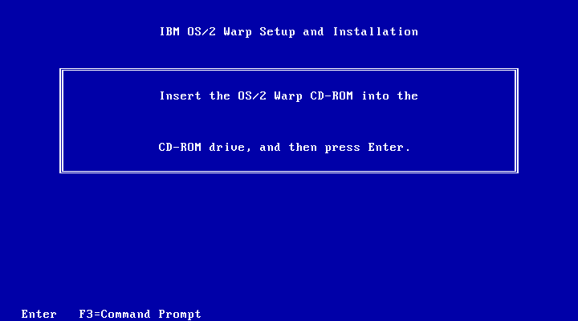

This is the prompt mentioned above, where you need to switch to the Client ISO, and hit Enter to continue.

After NEXTing a few more times, you will enter the partition interface. The partitioning logic of OS/2 is different from Windows and Linux which we are used to (in fact I'm not clear either on the partition scheme), but since we only need one partition to boot the OS, we can simply follow the steps:

First select `Install boot manager` (Similar to `bootmgr` and `Grub`).

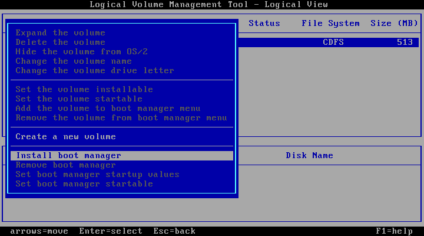

Then create a Volume (similar to a drive letter in Windows / mount point in Linux). Make sure to select `can be made bootable`, and give it a name (not empty).

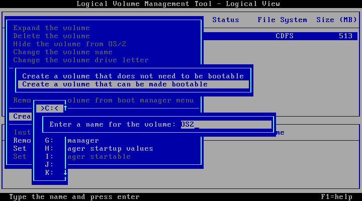

Next, create a partition for the Volume. Select `Allocate from free space`, name the partition, and enter the size (max by default).

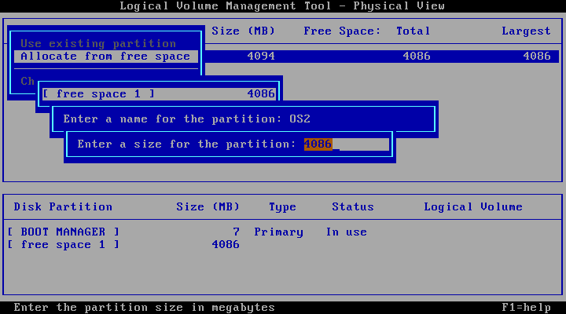

Press F3 to exit the partition manager, and save the changes.

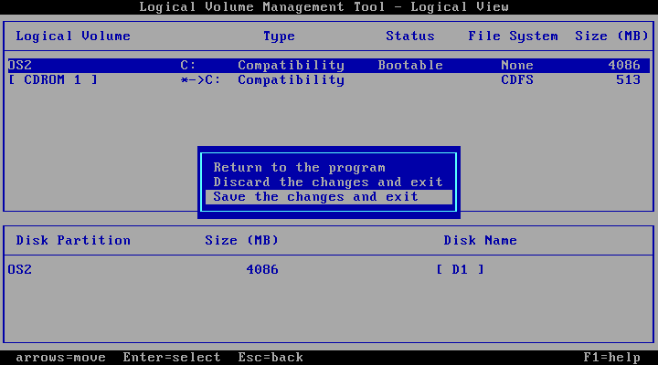

Partition manager will tell you to reboot before continuing with OS/2 installation. Swap the CDROM image to Boot again, and simply reset the VM.

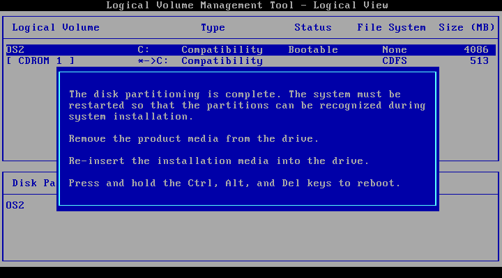

Insert the Client CD when prompted, and continue with the installation. You mostly only need to select Next all the way, with one exception that the sound support for OS/2 isn't enabled by default. After the installer copied all files and rebooted for the first time, an interface will pop up and ask about enabled features. Click `Multimedia Device Support`:

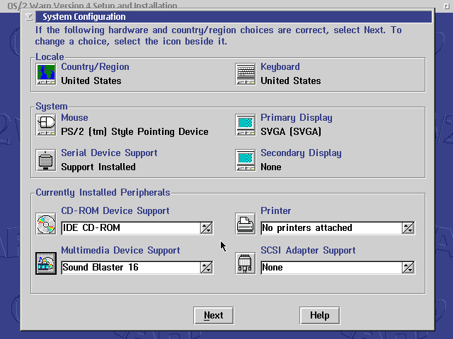

Then choose Sound Blaster 16 (sound card VirtualBox is emulating), and add it to the right side so it will be installed:

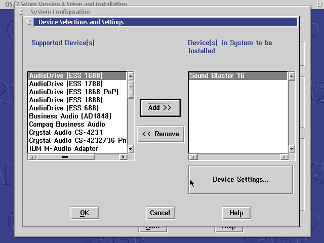

Continue NEXTing until you reach the desktop. Note that you'll need to set username and password in one of the steps.

A window will pop up and let you decide if you want to install some software included with the installation image. Here I installed all of them, but not doing this isn't going to affect further operations.

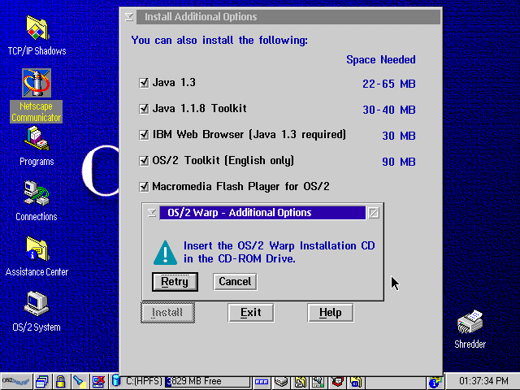

Now OS/2 Warp itself has been installed successfully. We need to do some basic graphics and network configuration.

Enable Networking and Hi-Res Display
------------------------------------

Double click the `OS/2 System` icon, and double click `System Setup` to enter the "control panel".

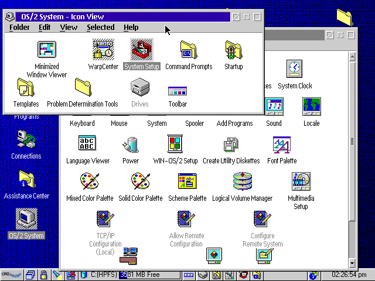

Here double click `TCP/IP Configuration (Local)` for the network settings. Choose `Enable Interface` to enable the network card, select DHCP, save, but do not reboot yet.

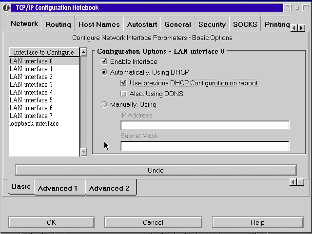

Double click `System` in "Control Panel", and resolution settings will pop up by default. Scroll all the way down and select the last option, corresponding to 1024x768 resolution with 24 bit color depth.

If you click on the plus sign near `Page 1 of 2`, you can select resolutions up to 1600x1200. Choose if you want.

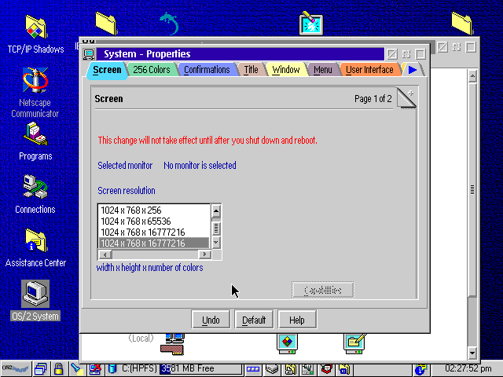

After you choose the resolution, click on the "computer and cross" icon to shutdown, and reboot the system, so the network and display settings come into effect.

Install RPM & YUM
-----------------

RPM and YUM are package managers originally used by RHEL, CentOS, etc. With hard work from the open source community, now you can use them to manage packages in OS/2.

The first step to install RPM and YUM in OS/2 is to install WarpIN. WarpIN itself is a package manager for OS/2, which is needed to set up a base environment for YUM later. Download WarpIN from the link in `Manual Installation` section on [eCSoft/2 WarpIN page](https://ecsoft2.org/warpin), and copy it into the VM for installation.

> I use VirtualBox's Ad-hoc VISO to copy files into VM. You can select files to be added into a virtual CD. If you use other VM software such as VMware, you may need to create ISOs manually with UltraISO, etc.

Next thing to be installed is kLIBC, a runtime library needed by RPM and YUM.

> kLIBC is the GCC runtime library in OS/2, providing features including translation between OS/2 and Unix style file paths.

kLIBC can be downloaded from Arca Noae's repo (the company that maintains ArcaOS). It's free, and is available as an exe file. Download `klibccfg_1_0_2_2.exe` from [this page on Arca Noae repo](https://repos.arcanoae.com/anpm/), copy into VM and install.

After installation, click on the "computer and cross" icon to shutdown, and reboot the system, to make sure the settings come into effect.

Next thing is ANPM, ArcaOS package manager, based on RPM and YUM. ANPM is free itself, and can also be downloaded from [the page on Arca Noae repo](https://repos.arcanoae.com/anpm/). Download `anpm_1_0_5.exe` in folder `105`, copy into VM and install.

After installation, double click folder `Arca Noae Package Manager` on desktop and launch ANPM package manager. On first start it will need to download an RPM and YUM environment, and will let you choose an architecture:

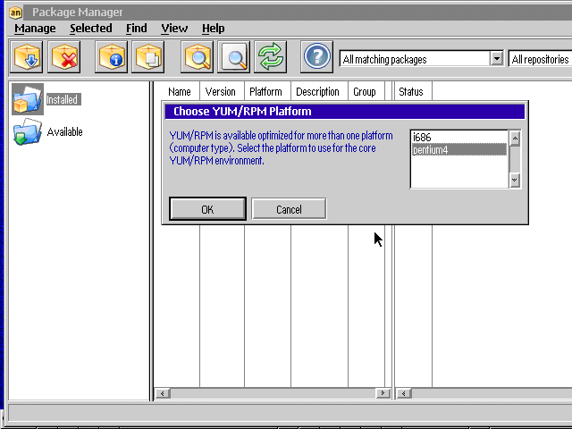

Since it's 2020 already, unless you dug up an old computer for realistic retro experience on OS/2, most of you should choose the newer `pentium4` architecture.

After download is complete, ANPM will ask about the target drive, select drive C. But do not reboot yet after installation is done. There is a bug with ANPM installation process, that will fail to change some settings, causing RPM and YUM to work abnormally. We need to do the edits by hand.

Click on the button on the center of taskbar, select `OS/2 Window` to open up a "command prompt":

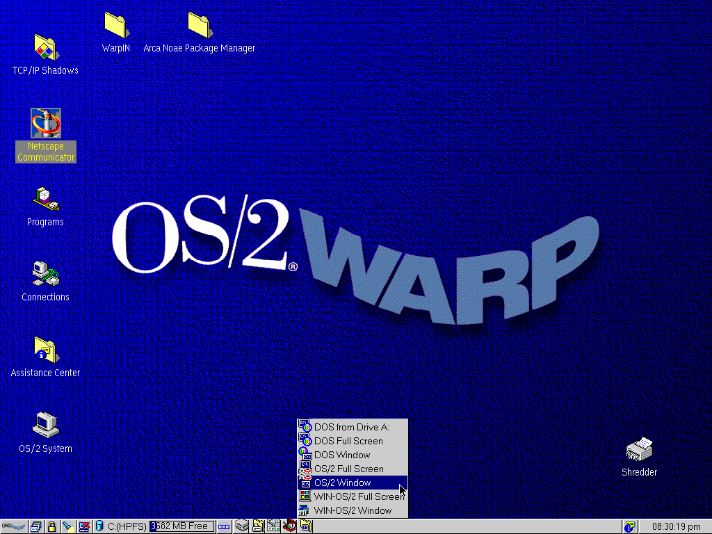

Type `e config.sys` to edit the configuration file `config.sys`. We need to modify:

- Find `LIBPATH=`, and add `C:\USR\LOCAL\LIB;C:\USR\LIB;` after the equal sign.
  - After edit, you will get something similar to:
  - `LIBPATH=C:\USR\LOCAL\LIB;C:\USR\LIB;C:\NETSCAPE\PROGRAM;...`
- Find `SET PATH=`, and add `C:\USR\BIN;` after the equal sign
  - After edit, you will get something similar to:
  - `SET PATH=C:\USR\BIN;C:\NETSCAPE\PROGRAM;...`
- Add a new line, `SET UNIXROOT=C:`, at the end of the file.

Close the window and save the file. Later, click on the "computer and cross" icon to shutdown, and reboot OS/2.

Reopen ANPM after reboot. ANPM will ask if you want to change `LIBPATH`, but since we've done it manually, choose No.

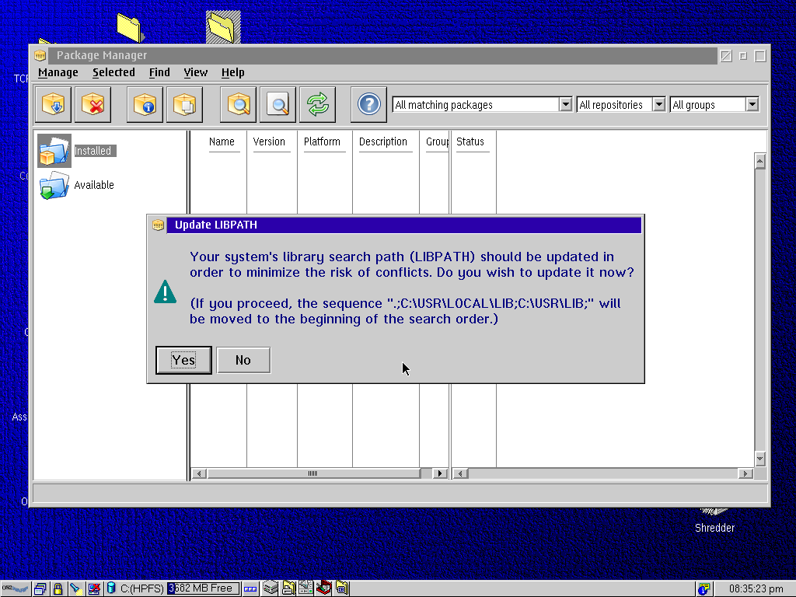

If ANPM shows a list of packages, everything is working properly.

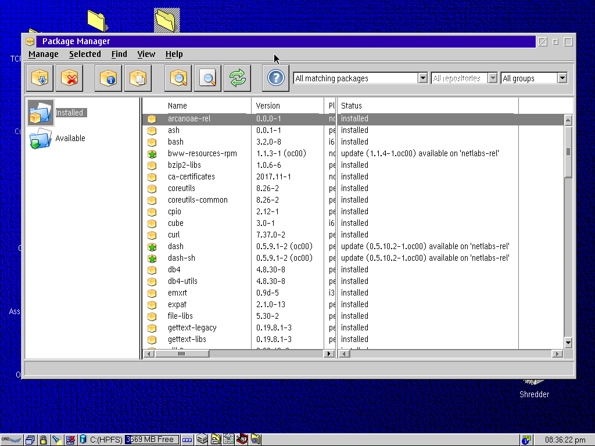

Then we can reopen the "command prompt" via means above, and do package search, upgrade and installation freely:

```bash
yum upgrade
```

Install Firefox
---------------

Finally the important part, installing Firefox browser. Here I'll use YUM to install all dependencies of Firefox, followed by downloading a precompiled Firefox archive file and extracting it.

Why download Firefox directly? Because RPM packaged Firefox is only available in Arca Noae's paid software repo, and the free repo we're using right now don't have Firefox available. But this will not stop us from downloading Firefox ourselves.

> Installation commands and download URLs come from [Firefox page on eCSoft/2](https://ecsoft2.org/firefox).

Since I don't like ANPM's UI, I will finish all operation on OS/2 commandline. After reopening the "commandline prompt", type in these (long) YUM commands just as if you're using CentOS:

```bash
yum install unzip
yum install bww-resources-rpm cairo dash-sh fontconfig freetype hunspell libc libc-devel libcx libgcc1 libicu libjpeg-turbo libkai libpng libstdc++6 libvpx nspr nss nss-util os2-base os2-mpts pango pixman pthread zlib
```

Since Arca Noae's repo is located out of mainland China, if you happen to be in mainland China, you will need to wait patiently for the low download speed. In the meantime, YUM may tell you about `Rpmdb checksum is invalid`; you may safely ignore them.

Then, download a ZIP archive of precompiled Firefox. Enter [Firefox page on eCSoft/2](https://ecsoft2.org/firefox), where download URLs to Firefox of different version, compilation date and architecture are available.

I choose the second link, `Firefox v. 45.9.0 (15/4/2019, Dave Yeo)`. This version corresponds to the `i386` universal version for Firefox 45.9.0. Theoretically you may download the first `Firefox v. 45.9.0 (Optimized version for Pentium M, 26/5/2019, Dave Yeo)` optimized for Pentium M, but I haven't tried it.

After you add the archive of Firefox to the virtual CDROM, you can unzip and run Firefox directly (remember to install `unzip`):

```bash
unzip D:\firefox*
cd C:\firefox
firefox
```

And we're done:

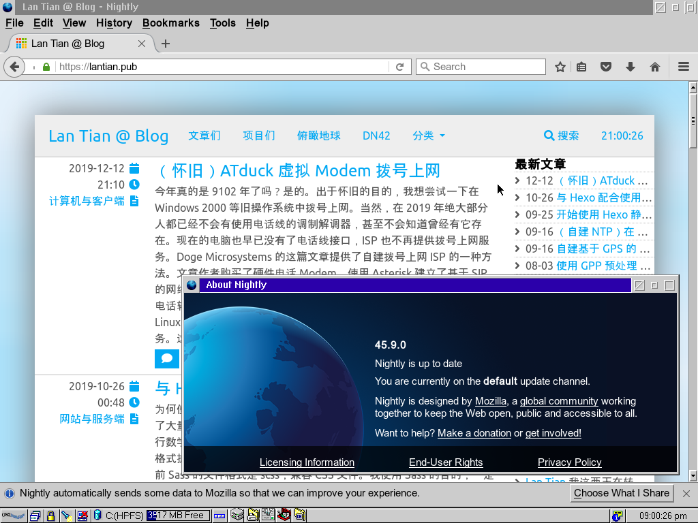

Pitfalls
--------

While I'm doing my own research, the largest pitfall is in installing the RPM and YUM environment. The initial guide available provides an old environment, whose installation process involves running some commands in commandline. But since its version is too old, a lot of DLLs will be missing after an upgrade, and even RPM/YUM will become unusable together.

ANPM itself also has a Bug with modifying `C:\config.sys` the config file, causing some important environment variables to be missing. These missing variables will stop YUM and RPM installed by ANPM from finding a series of DLLs, and become unusable. In addition, ANPM will not show any prompt about the problem, it will simply say that an YUM environment isn't available, and you'll need to install again. Things will still be the same after reinstallation.

The whole process is actually quite simple except for the pitfalls.
